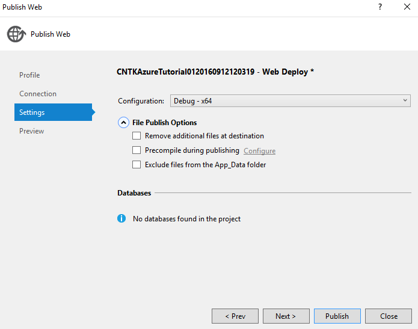
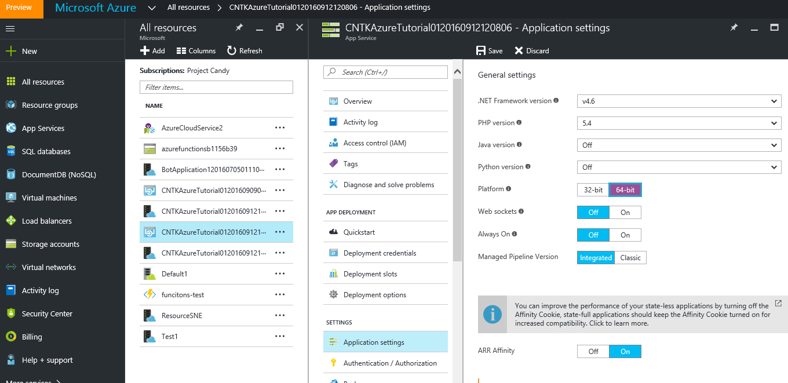

# Evaluate a model in an Azure WebApi

## Deploy through Azure Machine Learning Command Line
One way to deploy a CNTK model on Azure and be able to run the deployed model through Web APIs is via a command line interface to Azure Machine Learning.  Click [here](https://github.com/Azure/Machine-Learning-Operationalization/blob/master/samples/cntk/tutorials/realtime/image_classification.md) to learn how.

## Deploy through ASP.NET
We will walk you to the required steps to deploy a CNTK model on Azure and send web requests to the Azure endpoint to 
evaluate data against the deployed model. We will build this functionality in form of a WebApi, but focus on the most 
basic Azure functionality. Please refer to more advanced Azure documentation to learn about all the advanced abilities, i.e. parameter passing etc.

### Requirements

As we are currently using VS2013 to build CNTK, we focus on this version of Visual Studio. You might need to make small 
adjustments for VS2015 to reproduce the steps we describe. 

#### Web Development Feature for Visual Studio

You need to enable Web-Development features in Visual Studio. You can see if this feature is enabled (and enable if necessary) 
by executing the VS installer again (`Control Panel -> Program and Features -> Microsoft Visual Studio 201x`, right click and select 
`Change` to invoke the VS installer)

#### Azure SDK

The Azure SDK for .NET needs to be installed on your development machine. The download page for this 
is: [Azure SDK Download](https://azure.microsoft.com/downloads/)

#### Azure Account

Since we are going to host the CNTK model on Azure, you will need an Azure account. If you have an MSDN or Visual Studio subscription, that account will be sufficient to host your model for this tutorial. CNTK requires a 64-bit virtual machine to host, a free Azure account doesn’t include this capability and will not be sufficient.

Initially we will develop the WebApi locally and then upload this to our Azure instance. So you will be able to follow the majority of the steps even without access to Azure.

### Let’s get started

We already created a project blueprint called **[CNTKAzureTutorial01](https://github.com/Microsoft/CNTK/tree/master/Examples/Evaluation/CNTKAzureTutorial01)**. This project is part of the CNTK GitHub repository and can be found in the folder `Examples\Evaluation\CNTKAzureTutorial01`. 

We recommend you start from this solution, since we already added all the code we need. For completeness here is the list of operations to create the tutorial project:

- We started by creating a new project/solution in VisualStudio from `File->New->Project->Visual C#->Web->ASP.NET WebApplication`: CNTKAzureTutorial01. We picked an Azure API App template, added references to ‘Web API’ and made sure it is hosted locally (**NOT** hosted in the cloud – yet).

- Then we performed the following code changes to build the tutorial project:
    - In the ValueController.cs we added a few required using directives 
    - Replaced the code in `public async Task<IEnumerable<string>> Get()` to actually call our CNTK evaluation function
    - Added the function `public async Task<string[]> EvaluateCustomDNN(string imageUrl)`. We adopted this function from our CNTK Eval samples (method `EvaluateImageClassificationModel` from the CNTK reposiroty in the file `Examples\Evaluation\CSEvalClient\Program.cs`)
    - Added the file `CNTKImageProcessing.cs` to add a Bitmap-resize functionality. This is originating from the CNTK repository in `Examples/Evaluation/CSEvalClient/CntkBitmapExtensions.cs with minor adjustments` to namespace and class name
    - The directory of the created binaries in our solution needs to get added to the `PATH` environment of the application. This is required since our project includes native DLLs, and those are only loaded if they are reachable in the standard search path. We added the following code in the `Application_Start()` method in `global.asax`:
   
             string pathValue = Environment.GetEnvironmentVariable("PATH");
             string domainBaseDir = AppDomain.CurrentDomain.BaseDirectory;
             string cntkPath = domainBaseDir + @"bin\";
             pathValue += ";" + cntkPath;
             Environment.SetEnvironmentVariable("PATH", pathValue);
   
           
### Hosting the WebApi locally

These are the changes we performed so far. We still need to get the CNTK Eval functionality included in the project and 
need a model to evaluate. 

Add the CNTK Eval functionality to the project. This is available as a Nuget package. In VS select `Tools -> Manage Nuget Packages`, pick `Nuget.org` as the online source, search for `CNTK` and install the latest package version.

Now we need a model to evaluate. Download the [ResNet_18.model](https://www.cntk.ai/resnet/ResNet_18.model) and save it in the directory `CNTK\Models` in the solution. The model file needs also to be included in the solution (`Project -> Add existing Item`)

CNTK requires a 64-bit runtime environment. Make sure in the Configuration Manager that the project is compiled for the x64 platform. In addition, the WebApi we are creating has to be hosted in a 64-bit instance of IIS. You can enforce this by selecting "Use 64 bit version of IIS Express for web sites and projects" in `Tools -> Options -> Project and Solutions -> WebProjects`

 

At this point you have performed all the necessary steps to execute the model locally on your machine. In Visual Studio press `F5` to run the project. This will open an internet browser on the default web site and display an error message. This is to be expected since we have created a WebApi and not a website. We easily call the implemented WebApi by changing the address in the browser to: 

`http://localhost:<portnumber>/api/values`

This will call the `Get()` method in the ValuesController-Class which will in turn call the method `EvaluateCustomDNN()` and return a result to your web browser

### Hosting the WebApi on Azure

With this we accomplished the first part of our mission, now we need this functionality hosted in Azure!
From the Build menu of your project select the `Publish` command. Pick `Microsoft Azure App Service` as the publishing target
 

In the AppService dialog you have to log-in with your account and select the appropriate subscription and resource group. Be sure to pick a resource group that supports 64-bit virtual machines (the ‘free’ resource group isn’t sufficient for this). During the final publishing steps you have to pick a x64-configuration in the Setting menu. This is required to also publish the native binary components of CNTK to Azure

Once you publish you model and you call your published WebApi in the browser, you will see an error message. Open the Azure portal and make sure your WebApi is running on a 64-bit platform (change and ‘save’ the setting if required, this will also restart your virtual machine instance in Azure). 

Once you performed these changes, you will be able to call you WebApi under
`http://<yourwebapp>.azurewebsites.net/api/values`
 

This project showed you how to integrate the CNTK Eval functionality in an Azure WebApi and setup Azure to run the CNTK eval binaries. In a next step you can now add new APIs to dynamically supply data to the eval-function or upload new model version. These are WebApi/Azure development taks, and you should refer to the Azure documentation for this.

