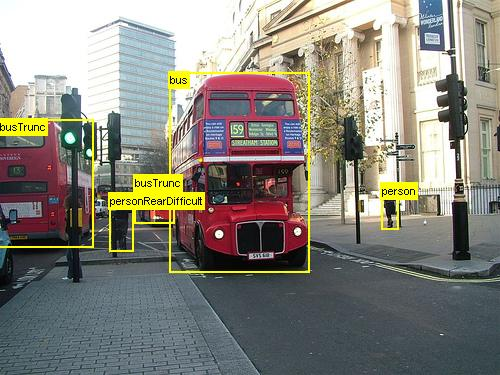
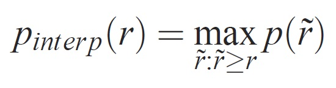

# Object  detection using Fast R-CNN

**Table of Contents**

- [Summary](#summary)
- [Setup](#setup)
- [Run the toy example](#run-the-toy-example)
- [Run Pascal VOC](#run-pascal-voc)
- [Train CNTK Fast R-CNN on your own data](#train-on-your-own-data)
- [Technical details](#technical-details)
- [Algorithm details](#algorithm-details)

## Summary

<p align="center">
<a target="_blank" href="./Tutorial_FastRCNN/svm_4WIN_20160803_12_37_07_Pro.jpg"></a>
<a target="_blank" href="./Tutorial_FastRCNN/bus_01.jpg"></a>
</p>

**Fast R-CNN is now also supported in the CNTK Python API (see [A2_RunCntk_py3.py](https://github.com/Microsoft/CNTK/blob/master/Examples/Image/Detection/FastRCNN/A2_RunCntk_py3.py) and the description below).**

The above are examples images and object annotations for the grocery data set (left) and the Pascal VOC data set (right) used in this tutorial.

`Fast R-CNN` is an object detection algorithm proposed by `Ross Girshick` in 2015. 
The paper is accepted to ICCV 2015, and archived at https://arxiv.org/abs/1504.08083. 
Fast R-CNN builds on previous work to efficiently classify object proposals using deep convolutional networks. 
Compared to previous work, Fast R-CNN employs a `region of interest pooling` scheme that allows to reuse the computations from the convolutional layers.

The following are the main resources for CNTK Fast R-CNN:

|||
|:-----------------|:---
|Recipe            |[CNTK Python API](https://github.com/Microsoft/CNTK/blob/master/Examples/Image/Detection/FastRCNN) (see A2_RunCntk_py3.py) or [Brain Script config file](https://github.com/Microsoft/CNTK/blob/master/Examples/Image/Detection/FastRCNN) (see fastrcnn.cntk).
|pre-trained models |Download pre-trained Fast R-CNN models for the [grocery](https://www.cntk.ai/Models/FRCN_Grocery/Fast-RCNN.model) data or the [Pascal VOC](https://www.cntk.ai/Models/FRCN_Pascal/Fast-RCNN.model) data set. 
|Data              |[Example data](#example-data-and-baseline-model) (food items in a fridge) and [Pascal VOC data](#run-pascal-voc).
|How to run        |Follow the description below.

Additional material: a detailed tutorial for object detection using CNTK Fast R-CNN 
(including optional SVM training and publishing the trained model as a Rest API) can be found [here](https://github.com/Azure/ObjectDetectionUsingCntk).

## Setup

To run the code in this example, you need a CNTK python environment (see [here](./Setup-CNTK-on-your-machine.md) for setup help). You need to work from your Python 3.4 environment (if you are using Anaconda Python type `activate cntk-py34` (from a standard command line, not PowerShell), assuming `cntk-py34` is your environment name). Further you need to install a few additional packages. From your Python 3.4 environment (64bit version assumed, Python 3.5 analogously), go to the FastRCNN folder and run:

`pip install -r requirements.txt`

Known issue: to install scikit-learn you might have to run `conda install scikit-learn` if you use Anaconda Python. 
You will further need Scikit-Image and OpenCV to run these examples (and possibly numpy and scipy if your Python 3.4 package does not come with them). 
You need to download the corresponding wheel packages and install them manually. On Linux you can `conda install scikit-image opencv`. 
For Windows users, visit http://www.lfd.uci.edu/~gohlke/pythonlibs/, and download:

* Python 3.4
  * scikit_image-0.12.3-cp34-cp34m-win_amd64.whl 
  * opencv_python-3.1.0-cp34-cp34m-win_amd64.whl
* Python 3.5
  * scikit_image-0.12.3-cp35-cp35m-win_amd64.whl  
  * opencv_python-3.2.0-cp35-cp35m-win_amd64.whl

Once you download the respective wheel binaries, install them with (Python 3.5 analogously):

`pip install your_download_folder/scikit_image-0.12.3-cp34-cp34m-win_amd64.whl`  
`pip install your_download_folder/opencv_python-3.1.0-cp34-cp34m-win_amd64.whl`

Remark 1: if you see the message _No module named past_ when running the scripts please execute `pip install future`.
<br>Remark 2: If you have a Python 3.5 environment you need the corresponding _cp35_ wheels.

This tutorial code assumes you are using 64bit version of Python, either 3.4 or 3.5 on Windows or 3.4 on Linux, since the required Fast R-CNN DLL files under [utils](https://github.com/Microsoft/CNTK/tree/master/Examples/Image/Detection/FastRCNN/fastRCNN/utils) 
are prebuilt for those versions. If your task requires the use of a different Python version, please recompile these DLL files yourself in the correct environment (see [below](#pre-compiled-binaries-for-bounding-box-regression-and-non-maximum-suppression)). 

The tutorial further assumes that **the folder where cntk.exe resides is in your PATH environment variable**. (To add the folder to your PATH you can run the following command from a command line (assuming the folder where cntk.exe is on your machine is C:\src\CNTK\x64\Release): `set PATH=C:\src\CNTK\x64\Release;%PATH%`.)

### Pre-compiled binaries for bounding box regression and non maximum suppression

The folder `Examples\Image\Detection\FastRCNN\fastRCNN\utils` contains pre-comiled binaries that are required for running Fast R-CNN. They versions that are currently contained in the repo are Python 3.4 and 3.5 for Windows and Python 3.4 for Linux, all 64 bit. If you need a different version you can compile it following these steps:

* `git clone --recursive https://github.com/rbgirshick/fast-rcnn.git`
* `cd $FRCN_ROOT/lib`
* `make`
  * Alternatively you can run `python setup.py build_ext --inplace`. On Windows you might have to comment out the extra compile args in lib/setup.py:
  ```
  ext_modules = [
    Extension(
        "utils.cython_bbox",
        ["utils/bbox.pyx"],
        #extra_compile_args=["-Wno-cpp", "-Wno-unused-function"],
    ),
    Extension(
        "utils.cython_nms",
        ["utils/nms.pyx"],
        #extra_compile_args=["-Wno-cpp", "-Wno-unused-function"],
    )
  ]
  ```
* copy the generated `cython_bbox` and `cython_nms` binaries from `$FRCN_ROOT/lib/utils` to `$CNTK_ROOT/Examples/Image/Detection/FastRCNN/fastRCNN/utils`.


### Example data and baseline model

We use a pre-trained AlexNet model as the basis for Fast-R-CNN training. 
Both the example dataset and the pre-trained AlexNet model can be downloaded by running the following Python command from the FastRCNN folder:

`python install_fastrcnn.py`

## Run the toy example

In the toy example we train a CNTK Fast  R-CNN model to detect grocery items in a refrigirator. 
All required scripts are in `<cntkroot>/Examples/Image/Detection/FastRCNN`.

### Quick guide

To run the toy example, make sure that in `PARAMETERS.py` the `datasetName` is set to `"grocery"`.

* Run `A1_GenerateInputROIs.py` to generate the input ROIs for training and testing.
* Run `A2_RunCntk_py3.py` to train a Fast R-CNN model using the CNTK Python API and compute test results.
  * Alternatively run `A2_RunCntk.py` to train and test using cntk.exe and BrainScript.
  * Alternatively you can download the pre-trained CNTK Fast R-CNN model for the grocery example [here](https://www.cntk.ai/Models/FRCN_Grocery/Fast-RCNN.model). ([Details](#using-a-pre-trained-model))
* Run `A3_ParseAndEvaluateOutput.py` to compute the mAP ([mean average precision](#map-mean-average-precision)) of the trained model.

The output from script A3 should contain the following:

```
Evaluating detections
AP for         avocado = 1.0000
AP for          orange = 1.0000
AP for          butter = 1.0000
AP for       champagne = 1.0000
AP for          eggBox = 0.7500
AP for          gerkin = 1.0000
AP for         joghurt = 1.0000
AP for         ketchup = 0.6667
AP for     orangeJuice = 1.0000
AP for           onion = 1.0000
AP for          pepper = 1.0000
AP for          tomato = 0.7600
AP for           water = 0.5000
AP for            milk = 1.0000
AP for         tabasco = 1.0000
AP for         mustard = 1.0000
Mean AP = 0.9173
DONE.
```

To visualize the bounding boxes and predicted labels you can run `B3_VisualizeOutputROIs.py` (click on the images to enlarge): 

<p align="center">
<a target="_blank" href="./Tutorial_FastRCNN/nn_0WIN_20160803_11_28_42_Pro.jpg"></a>
<a target="_blank" href="./Tutorial_FastRCNN/nn_1WIN_20160803_11_42_36_Pro.jpg"></a>
<a target="_blank" href="./Tutorial_FastRCNN/nn_2WIN_20160803_11_46_03_Pro.jpg"></a>
<a target="_blank" href="./Tutorial_FastRCNN/nn_3WIN_20160803_11_48_26_Pro.jpg"></a>
<a target="_blank" href="./Tutorial_FastRCNN/nn_4WIN_20160803_12_37_07_Pro.jpg"></a>
</p>

### Step details

__A1:__ The script first `A1_GenerateInputROIs.py` generates ROI candidates for each image using [selective search](#selective-search). 
It then stores them in a [CNTK Text Format](./BrainScript-CNTKTextFormat-Reader.md) as input for `cntk.exe`. 
Additionally the required CNTK input files for the images and the ground truth labels are generated. 
The script generates the following folders and files under the `FastRCNN` folder:

* `proc` - root folder for generated content.
  * `grocery_2000` - contains all generated folders and files for the `grocery` example using `2000` ROIs. If you run again with a different number of ROIs the folder name will change correspondingly.
    * `rois` - contains the raw ROI coordinates for each image stored in text files.
    * `cntkFiles` - contains the formatted CNTK input files for images (`train.txt` and `test.txt`), ROI coordinates (`xx.rois.txt`) and ROI labels (`xx.roilabels.txt`) for `train` and `test`. (Format details are provided [below](#cntk-input-file-format).) 

All parameters are contained in `PARAMETERS.py`, for example `cntk_nrRois = 2000` to set the number of ROIs used for training and testing. We describe parameters in the section [Parameters](#parameters) below.

__A2:__ The script `A2_RunCntk.py` runs cntk using cntk.exe and a brain script config file ([configuration details](#cntk-configuration)). 
A script that uses the new CNTK Python API for Fast R-CNN training will be added soon.
The trained model is stored in the folder `cntkFiles/Output` of the corresponding `proc` sub-folder. 
The trained model is tested seperately on both the training set and the test set. 
During testing for each image and each corresponding ROI a label is predicted and stored in the files `test.z` and `train.z` in the `cntkFiles` folder.

__A3:__ The evaluation step parses the CNTK output and computes the [mAP](#map-mean-average-precision) comparing the predicted results with the ground truth annoations. 
[Non maximum suppression](#NMS-Non-Maximum-Suppression) is used to merge overlapping ROIs. You can set the threshold for non maximum suppresion in `PARAMETERS.py` ([details](#parameters)).

### Using a pre-trained model

Download links for pre-trained models are provided at the top of this page. 
Store the model in the `cntkFiles/Output` folder under the corresponding proc sub-folder, for example `proc/grocery_2000/cntkFiles/Output` for the toy example.
__Note:__ if you are using a pre-trained model you still need to run step A2 to compute the predicted labels, i.e. CNTK will skip the training and only run the testing.

### Additional scripts

There are three optional scripts you can run to visualize and analyze the data:

* `B1_VisualizeInputROIs.py` visualizes the candidate input ROIs.
* `B2_EvaluateInputROIs.py` computes the recall of the ground truth ROIs with respect to the candidate ROIs.
* `B3_VisualizeOutputROIs.py` visualize the bounding boxes and predicted labels.

## Run Pascal VOC

The [Pascal VOC](http://host.robots.ox.ac.uk/pascal/VOC/) (PASCAL Visual Object Classes) data is a well known set of standardised images for object class recognition. 
Training or testing CNTK Fast R-CNN on the Pascal VOC data requires a GPU with at least 4GB of RAM. 
Alternatively you can run using the CPU, which will however take _some_ time. 
In this case we strongly recommend to download the pre-trained model (see [Using a pre-trained model](#using-a-pre-trained-model)).

### Getting the Pascal VOC data

You need the 2007 (trainval and test) and 2012 (trainval) data as well as the precomputed ROIs used in the original paper. 
You need to follow the folder structure described below. 
The scripts assume that the Pascal data resides in `<cntkroot>/Examples/Image/DataSets/Pascal`. 
If you are using a different folder please set `pascalDataDir` in `PARAMETERS.py` correspondingly.

* Download and unpack the 2012 trainval data to `DataSets/Pascal/VOCdevkit2012`
  * Website: [http://host.robots.ox.ac.uk/pascal/VOC/voc2012/](http://host.robots.ox.ac.uk/pascal/VOC/voc2012/)
  * Devkit: [http://host.robots.ox.ac.uk/pascal/VOC/voc2012/VOCtrainval_11-May-2012.tar](http://host.robots.ox.ac.uk/pascal/VOC/voc2012/VOCtrainval_11-May-2012.tar)
* Download and unpack the 2007 trainval data to `DataSets/Pascal/VOCdevkit2007`
  * Website: [http://host.robots.ox.ac.uk/pascal/VOC/voc2007/](http://host.robots.ox.ac.uk/pascal/VOC/voc2007/)
  * Devkit: [http://host.robots.ox.ac.uk/pascal/VOC/voc2007/VOCtrainval_06-Nov-2007.tar](http://host.robots.ox.ac.uk/pascal/VOC/voc2007/VOCtrainval_06-Nov-2007.tar)
* Download and unpack the 2007 test data into the same folder `DataSets/Pascal/VOCdevkit2007`
  * [http://host.robots.ox.ac.uk/pascal/VOC/voc2007/VOCtest_06-Nov-2007.tar](http://host.robots.ox.ac.uk/pascal/VOC/voc2007/VOCtest_06-Nov-2007.tar)
* Download and unpack the precomputed ROIs to `DataSets/Pascal/selective_search_data`
  * [http://www.cs.berkeley.edu/~rbg/fast-rcnn-data/selective_search_data.tgz](http://www.cs.berkeley.edu/~rbg/fast-rcnn-data/selective_search_data.tgz)

The `VOCdevkit2007` folder should look like this (similar for 2012):
```
VOCdevkit2007/VOC2007
VOCdevkit2007/VOC2007/Annotations
VOCdevkit2007/VOC2007/ImageSets
VOCdevkit2007/VOC2007/JPEGImages
```

### Running CNTK on Pascal VOC

To run on the Pascal VOC data make sure that in `PARAMETERS.py` the `datasetName` is set to `"pascal"`.

* Run `A1_GenerateInputROIs.py` to generate the CNTK formatted input files for training and testing from the downloaded ROI data.
* Run `A2_RunCntk.py` to train a Fast R-CNN model and compute test results.
  * If you downloaded the [pre-trained model](#using-a-pre-trained-model) you still need to run step A2 to compute the predicted labels. 
  To decrease the required time you can skip computing the predictions for the training data by setting `command = Train:WriteTest` (i.e. reomving `WriteTrain`) in the `fastrcnn.cntk` file.
* Run `A3_ParseAndEvaluateOutput.py` to compute the mAP ([mean average precision](#map-mean-average-precision)) of the trained model.
  * Please note that this is work in progress and the results are preliminary as we are training new baseline models.
  * Please make sure to have the latest version from CNTK master for the files 
  [fastRCNN/pascal_voc.py](https://github.com/Microsoft/CNTK/blob/master/Examples/Image/Detection/FastRCNN/fastRCNN/pascal_voc.py) and 
  [fastRCNN/voc_eval.py](https://github.com/Microsoft/CNTK/blob/master/Examples/Image/Detection/FastRCNN/fastRCNN/voc_eval.py) 
  to avoid encoding errors.

## Train on your own data

To train a CNTK Fast R-CNN model on your own data set we provide two scripts to annotate rectangular regions on images and assign labels to these regions. 
The scripts will store the annotations in the correct format as required by the first step of running Fast R-CNN (`A1_GenerateInputROIs.py`).
First, store your images in the following folder structure

* `<your_image_folder>/negative` - images used for training that don't contain any objects
* `<your_image_folder>/positive` - images used for training that do contain objects
* `<your_image_folder>/testImages` - images used for testing that do contain objects

For the negative images you do not need to create any annotations. For the other two folders use the proveded scripts:

* Run `C1_DrawBboxesOnImages.py` to draw bounding boxes on the images.
  * In the script set `imgDir = <your_image_folder>` before running.
  * Add annotations using the mouse cursor. Once all objects in an image are annotated, 
  pressing key 'n' writes the .bboxes.txt file and then proceeds to the next image, 
  'u' undoes (i.e. removes) the last rectangle, and 'q' quits the annotation tool.
* Run `C2_AssignLabelsToBboxes.py` to assign labels to the bounding boxes.
  * In the script set `imgDir = <your_image_folder>` before running...
  * ... and adapt the _classes_ in the script to reflect your object categories, for example `classes = ("dog", "cat", "octopus")`.
  * The script loads these manually annotated rectangles for each image, displays them one-by-one, 
  and asks the user to provide the object class by clicking on the respective button to the left of the window. 
  Ground truth annotations marked as either "undecided" or "exclude" are fully excluded from further processing.

Before running CNTK Fast R-CNN using scripts A1-A3 you need to add your data set to `PARAMETERS.py`:

* Set the data set name to a new name `datasetName = "myOwnImages"`
* For the `# project-specific parameters` add a new for `myOwnImages`. You can start by copying the section from `grocery`
  * Adapt the _classes_ to reflect your object categories. Following the above example this would look like 
  `classes = ('__background__',  'dog', 'cat', 'octopus')`.
  * Set `imgDir = <your_image_folder>`.
  * Optionally you can adjust more parametes, e.g. for ROI generation and pruning (see [Parameters](#parameters) section).

Ready to train on your own data! (Use the [same steps](#quick-guide) as for the toy example.)

## Technical details

### Parameters

The main parameters in `PARAMETERS.py` are
* `datasetName` - which data set to use
* `cntk_numRois` - how many ROIs to use for training and testing
* `nmsThreshold` - Non Maximum suppression threshold (in range [0,1]). The lower the more ROIs will be combined. It used for both evalutation and visualization.

All parameters for ROI generation, such as minimum and maximum width and heigth etc., 
are described in `PARAMETERS.py` next to the parameters themselves. They are all set to a default value which is reasonable. 
You can overwrite them in the `# project-specific parameter` section corresponding to the data set you are using.

### CNTK configuration

The CNTK brain script configuration file that is used to train and test Fast R-CNN is 
[fastrcnn.cntk](https://github.com/Microsoft/CNTK/blob/master/Examples/Image/Detection/FastRCNN/fastrcnn.cntk). 
The part that is constructing the network is the `BrainScriptNetworkBuilder` section in the `Train` command:

```
BrainScriptNetworkBuilder = {
    network     = BS.Network.Load ("../../../../../pre-trainedModels/AlexNet.model")
    convLayers  = BS.Network.CloneFunction(network.features, network.conv5_y, parameters = "constant")
    fcLayers    = BS.Network.CloneFunction(network.pool3, network.h2_d)

    model (features, rois) = {
        featNorm = features - 114
        convOut  = convLayers (featNorm)
        roiOut   = ROIPooling (convOut, rois, (6:6))
        fcOut    = fcLayers (roiOut)
        W        = ParameterTensor{($NumLabels$:4096), init="glorotUniform"}
        b        = ParameterTensor{$NumLabels$, init = 'zero'}
        z        = W * fcOut + b
    }.z

    imageShape = $ImageH$:$ImageW$:$ImageC$         # 1000:1000:3
    labelShape = $NumLabels$:$NumTrainROIs$         # 21:64
    ROIShape   = 4:$NumTrainROIs$                   # 4:64

    features = Input {imageShape}
    roiLabels = Input {labelShape}
    rois = Input {ROIShape}

    z = model (features, rois)
    
    ce = CrossEntropyWithSoftmax(roiLabels, z, axis = 1)
    errs = ClassificationError(roiLabels, z, axis = 1)
    
    featureNodes    = (features:rois)
    labelNodes      = (roiLabels)
    criterionNodes  = (ce)
    evaluationNodes = (errs)
    outputNodes     = (z)
}
```

In the first line the pre-trained AlexNet is loaded as the base model. Next two parts of the network are cloned: 
`convLayers` contains the convolutional layers with constant weights, i.e. they are not trained further. 
`fcLayers` contains the fully connected layers with the pre-trained weights, which will be trained further. 
The node names `network.features`, `network.conv5_y` etc. can be derived from looking at the log output of the cntk.exe call 
(contained in the log output of the `A2_RunCntk.py` script).

The model definition(`model (features, rois) = ...`) first normalizes the features by subtracting 114 for each channel and pixel. 
Then the normalized features are pushed through the `convLayers` followed by the `ROIPooling` and finally the `fcLayers`. 
The output shape (width:height) of the ROI pooling layer is set to `(6:6)` since this is the shape nd size that the 
pre-trained `fcLayers` from the AlexNet model expect. The output of the `fcLayers` is fed into a dense layer that 
predicts one value per label (`NumLabels`) for each ROI.

The following six lines define the input: an image of size 1000 x 1000 x 3 (`$ImageH$:$ImageW$:$ImageC$`), 
ground truth labels for each ROI (`$NumLabels$:$NumTrainROIs$`)
and four coordinates per ROI (`4:$NumTrainROIs$`) coresponding to (x, y, w, h), all relative with respect to the full width and height of the image.

`z = model (features, rois)` feeds the input images and rois into the defined network model and assigns the output to `z`. 
Both the criterion (`CrossEntropyWithSoftmax`) and the error (`ClassificationError`) are specified with `axis = 1` 
to account for the prediction error per ROI.

The reader section of the CNTK configuration is listed below. It uses three deserializers: 
* `ImageDeserializer` to read the image data. It picks up the image file names from `train.txt`, 
scales the image to the desired width and height while preserving the aspect ratio (padding empty areas with `114`) 
and transposes the tensor to have the correct input shape.
* One `CNTKTextFormatDeserializer` to read the ROI coordinates from `train.rois.txt`.
* A second `CNTKTextFormatDeserializer` to read the ROI labels from `train.roislabels.txt`.

The input file formats are described in the next section.

```
reader = {
    randomize = false
    verbosity = 2
    deserializers = ({
        type = "ImageDeserializer" ; module = "ImageReader"
        file = train.txt
        input = {
            features = { transforms = (
                { type = "Scale" ; width = $ImageW$ ; height = $ImageW$ ; channels = $ImageC$ ; scaleMode = "pad" ; padValue = 114 }:
                { type = "Transpose" }
            )}
            ignored = {labelDim = 1000}
        }
    }:{
        type = "CNTKTextFormatDeserializer" ; module = "CNTKTextFormatReader"
        file = train.rois.txt
        input = { rois = { dim = $TrainROIDim$ ; format = "dense" } }
    }:{
        type = "CNTKTextFormatDeserializer" ; module = "CNTKTextFormatReader"
        file = train.roilabels.txt
        input = { roiLabels = { dim = $TrainROILabelDim$ ; format = "dense" } }
    })
}
```

### CNTK input file format

There are three input files for CNTK Fast R-CNN corresponding to the three deserializers described above:

1) `train.txt` contains in each line first a sequence number, then an image filenames and finally a `0` (which is currently still needed for legacy reasons of the ImageReader).  
```
0 image_01.jpg 0
1 image_02.jpg 0
...
```
2) `train.rois.txt` ([CNTK text format](./BrainScript-CNTKTextFormat-Reader.md)) 
contains in each line first a sequence number, then the `|rois` identifier followed by a sequence of numbers. 
These are groups of four numbers corresponding to (x, y, w, h) of an ROI, 
all relative with respect to the full width and height of the image. There is a total of 4 * number-of-rois numbers per line.
```
0 |rois 0.2185 0.0 0.165 0.29 ...
```
3) `train.roilabels.txt` ([CNTK text format](./BrainScript-CNTKTextFormat-Reader.md)) 
contains in each line first a sequence number, then the `|roiLabels` identifier followed by a sequence of numbers. 
These are groups of number-of-labels numbers (either zero or one) per ROI encoding the ground truth class in a one-hot representation. 
There is a total of number-of-labels * number-of-rois numbers per line.
```
0 |roiLabels 0 0 0 0 0 0 0 1 0 0 0 0 0 0 0 0 0 0 0 0 0 0  ...
```

## Algorithm details

### Fast R-CNN
R-CNNs for Object Detection were first presented in 2014 by [Ross Girshick et al.](http://arxiv.org/abs/1311.2524), 
and were shown to outperform previous state-of-the-art approaches on one of the major object recognition challenges in the field: 
[Pascal VOC](http://host.robots.ox.ac.uk/pascal/VOC/). Since then, two follow-up papers were published which contain significant 
speed improvements: [Fast R-CNN](https://arxiv.org/pdf/1504.08083v2.pdf) and [Faster R-CNN](https://arxiv.org/abs/1506.01497).

The basic idea of R-CNN is to take a deep Neural Network which was originally trained for image classification using millions 
of annotated images and modify it for the purpose of object detection. The basic idea from the first R-CNN paper is illustrated 
in the Figure below (taken from the paper): (1) Given an input image, (2) in a first step, a large number region proposals are 
generated. (3) These region proposals, or Regions-of-Interests (ROIs), are then each independently sent through the network 
which outputs a vector of e.g. 4096 floating point values for each ROI. Finally, (4) a classifier is learned which takes the 
4096 float ROI representation as input and outputs a label and confidence to each ROI.  
<p align="center">
<a target="_blank" href="./Tutorial_FastRCNN/nn_0WIN_20160803_11_28_42_Pro.jpg"></a>
</p>

While this approach works well in terms of accuracy, it is very costly to compute since the Neural Network has to be evaluated 
for each ROI. Fast R-CNN addresses this drawback by only evaluating most of the network (to be specific: the convolution layers) 
a single time per image. According to the authors, this leads to a 213 times speed-up during testing and a 9x speed-up during 
training without loss of accuracy. This is achieved by using an ROI pooling layer which projects the ROI onto the convolutional 
feature map and performs max pooling to generate the desired output size that the following layer is expecting. 
In the AlexNet example used in this tutorial the ROI pooling layer is put between the last convolutional layer and the first 
fully connected layer (see [brain script code](#CNTK-configuration)).

The original Caffe implementation used in the R-CNN papers can be found at github:
[RCNN](https://github.com/rbgirshick/rcnn), [Fast R-CNN](https://github.com/rbgirshick/fast-rcnn), and [Faster R-CNN](https://github.com/rbgirshick/py-faster-rcnn). This tutorial uses some of the code from these repositories, notably (but not exclusively) for svm training and model evaluation.

#### SVM vs NN training

Patrick Buehler provides instructions on how to train an SVM on the CNTK Fast R-CNN output (using the 4096 features from the last fully connected layer) 
as well as a discussion on pros and cons [here](https://github.com/Azure/ObjectDetectionUsingCntk).

### Selective Search
[Selective Search](http://koen.me/research/pub/uijlings-ijcv2013-draft.pdf) is a method for finding a large set of possible 
object locations in an image, independent of the class of the actual object. It works by clustering image pixels into segments, 
and then performing hierarchical clustering to combine segments from the same object into object proposals. 

<p align="center">
<a target="_blank" href="./Tutorial_FastRCNN/WIN_20160803_11_29_07_Pro.noGridNoFiltering.roi.jpg"></a>
<a target="_blank" href="./Tutorial_FastRCNN/WIN_20160803_11_29_07_Pro.noGrid.roi.jpg"></a>
<a target="_blank" href="./Tutorial_FastRCNN/WIN_20160803_11_29_07_Pro.roi.jpg"></a>
</p>

To complement the detected ROIs from Selective Search, we add ROIs that uniform cover the image at different scales and aspect ratios. 
The image on the left shows an example output of Selective Search, where each possible object location is visualized by a green 
rectangle. ROIs that are too small, too big, etc. are discarded (middle) and finally ROIs that uniformly cover the image are added (right). 
These rectangles are then used as Regions-of-Interests (ROIs) in the R-CNN pipeline.

The goal of ROI generation is to find a small set of ROIs which however tightly cover as many objects in the image as possible. 
This computation has to be sufficiently quick, while at the same time finding object locations at different scales and aspect ratios. 
Selective Search was shown to perform well for this task, with good accuracy to speed trade-offs.

### NMS (Non Maximum Suppression)
Object detection methods often output multiple detections which fully or partly cover the same object in an image. 
These ROIs need to be merged to be able to count objects and obtain their exact locations in the image. 
This is traditionally done using a technique called Non Maximum Suppression (NMS). The version of NMS we use 
(and which was also used in the R-CNN publications) does not merge ROIs but instead tries to identify which ROIs 
best cover the real locations of an object and discards all other ROIs. This is implemented by iteratively selecting the 
ROI with highest confidence and removing all other ROIs which significantly overlap this ROI and are classified to be of 
the same class. The threshold for the overlap can be set in `PARAMETERS.py` ([details](#parameters)).

Detection results before (left) and after (right) Non Maximum Suppression:
<p align="center">
<a target="_blank" href="./Tutorial_FastRCNN/nn_noNms4WIN_20160803_12_37_07_Pro.jpg"></a>
<a target="_blank" href="./Tutorial_FastRCNN/nn_4WIN_20160803_12_37_07_Pro.jpg"></a>
</p>

### mAP (mean Average Precision)
Once trained, the quality of the model can be measured using different criteria, such as precision, recall, accuracy, 
area-under-curve, etc. A common metric which is used for the Pascal VOC object recognition challenge is to measure the 
Average Precision (AP) for each class. The following description of Average Precision is taken 
from [Everingham et. al](http://homepages.inf.ed.ac.uk/ckiw/postscript/ijcv_voc09.pdf). The mean Average Precision (mAP) is 
computed by taking the average over the APs of all classes.

_For a given task and class, the precision/recall curve is
computed from a method’s ranked output. Recall is defined
as the proportion of all positive examples ranked above a
given rank. Precision is the proportion of all examples above
that rank which are from the positive class. The AP summarises
the shape of the precision/recall curve, and is defined
as the mean precision at a set of eleven equally spaced
recall levels [0,0.1, . . . ,1]:_

<p align="center">

</p>

_The precision at each recall level r is interpolated by taking
the maximum precision measured for a method for which
the corresponding recall exceeds r:_

<p align="center">

</p>

_where p(˜r) is the measured precision at recall ˜r.
The intention in interpolating the precision/recall curve
in this way is to reduce the impact of the “wiggles” in
the precision/recall curve, caused by small variations in the
ranking of examples. It should be noted that to obtain a high
score, a method must have precision at all levels of recall –
this penalises methods which retrieve only a subset of examples
with high precision (e.g. side views of cars)._

