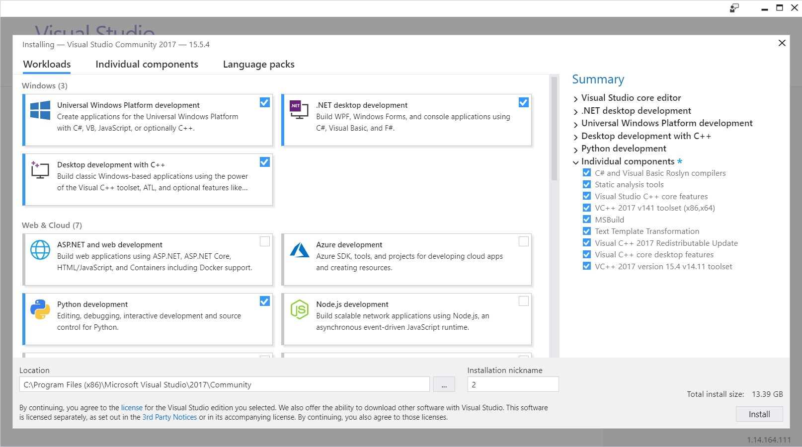
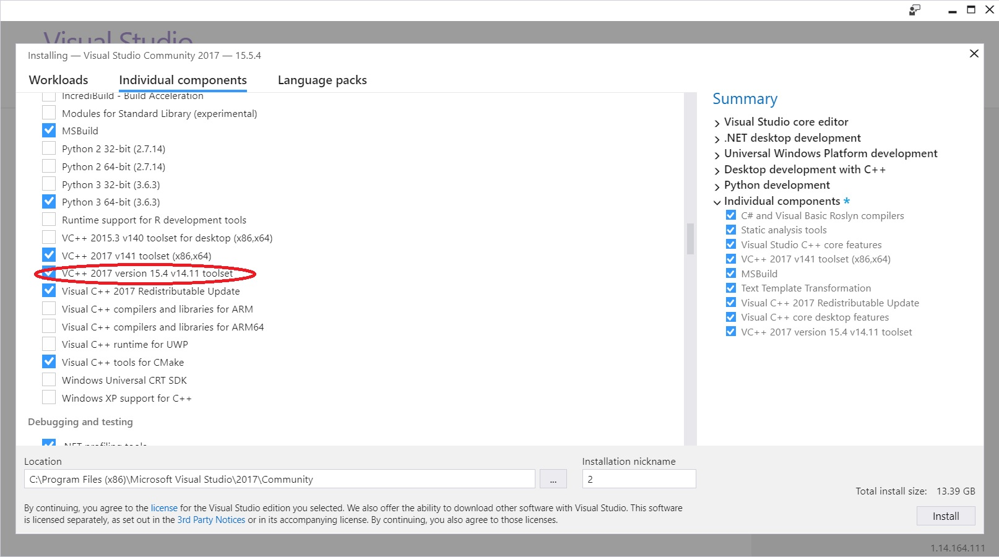

# Setup CNTK with script on Windows

If you want to build CNTK from source code and want to use the *Developer Install script*, this page is for you. 

If you are looking for any other kind of support in setting up a CNTK build environment or installing CNTK on your system, you should go [here](./Setup-CNTK-on-your-machine.md) instead. 

## For Your Consideration

Here are recommendations to make sure you can build CNTK successfully:

* The system locale on the build machine should be set to a language with a 'latin' based character set.
* Avoid extremely long path names. The build procedure uses copy-operations (XCOPY) that can run into problems with path expression with over 256 characters in length.

## 64-bit OS

CNTK requires a 64-bit Windows installation. We tested the build process on Windows 8.1, Windows 10, and Windows Server 2012 R2 and later. Other environments are not officially supported. For compatibility issues check [CNTK Production Build and Test configuration](./Test-Configurations.md).

## Preparation

There are steps required to create a CNTK development environment on your machine:

  * Installation of required tools
    * Visual Studio 2017
    * NVIDIA CUDA 9.0
    * Git 
    * Clone the CNTK Source code
  * Running the developer installation script
    * Setting command line options to configure script operation
    * Executing the script
  * Build and test

This page will walk you through all these steps. The script driven installation will create a development environment with all optional components, including NVIDIA tools, the Python environment, OpenCV and compression libraries. The script supports optional parameters to fine-tune the installation to your system (like the Anaconda installation directory etc.), details are available [here](./Setup-Windows-Devinstall-Script-Option.md)

## Installation of required tools

### Visual Studio 2017

Install Microsoft Visual Studio 2017 for Windows. A link to the download can be found [here](https://www.visualstudio.com/downloads/). You will need a Microsoft account and either a **free** membership in the subscription *Visual Studio Dev Essentials*, or a valid MSDN subscription. If you don't have a Microsoft account, the required subscription membership or both, you will be offered to enroll.

The Community Version of Visual Studio 2017 is sufficient to build CNTK.

During the installation process, please select Desktop development with C++ workload:



Besides, On the individual components screen make sure you add 'VC++ 2017 version 15.4 v14.11 toolset' to your installation for build with CUDA 9.0:



### Preexisting Visual Studio 2017 installation

You are also required to have the 'VC++ 2017 version 15.4 v14.11 toolset' installed on your system. To check open the Windows "Control Panel -> Programs -> Programs and Features' and select 'Visual Studio Community 2017' from the list of installed programs. This will start the Visual Studio setup again and allows you to make sure the 'VC++ 2017 version 15.4 v14.11 toolset' feature is installed on your system (see picture above).

> [!NOTE]
> If `VS2017INSTALLDIR` environment variable was not set by the Visual Studio installer, set it manually. The exact installation directory depends on both the *version* (2017 in this case) and *offering* (*Community*, *Enterprise*, etc) of Visual Studio, according to the following pattern: `C:\Program Files (x86)\Microsoft Visual Studio\<version>\<offering>`.
>
> For *Visual Studio 2017 Enterprise* edition, run:
> ```
> setx VS2017INSTALLDIR "C:\Program Files (x86)\Microsoft Visual Studio\2017\Enterprise"
> ```
> For *Visual Studio 2017 Community* edition, run:
> ```
> setx VS2017INSTALLDIR "C:\Program Files (x86)\Microsoft Visual Studio\2017\Community"
> ```

### NVIDIA CUDA 9

> [!IMPORTANT]
> In case you have a first-time Visual Studio 2017 installation as described above, you will need to install NVIDIA CUDA 9 now, even if you have already an existing installation of CUDA 9! The NVIDIA CUDA 9 installation adds support to the NVIDIA development tools to the Visual Studio environment, which is required to build CNTK successfully.

CNTK is set to build with CUDA 9.0. Download and install the NVIDIA CUDA 9.0 Toolkit:

* Download the required package from [this download page](https://developer.nvidia.com/cuda-90-download-archive)
* Run the installation procedure

Note: In case you don't have a system with a NVIDIA CUDA 9.0 compatible graphics card, the CUDA installer will issue a warning. Please continue the installer if you receive this warning, the CUDA tools will be installed, and you are able to build a NVIDIA GPU enabled version of CNTK on your system.

### Git

Git is required to clone the CNTK code base. There are various Git client tools available. You can also work with Git directly from inside Visual Studio. Here we assume you installed [Git for Windows](https://git-scm.com/download/win). We assume you installed Git using the default options in the Git installer (Especially 'Use Git from the Windows Command Prompt' and with the option "Checkout Windows-style, commit UNIX-style line endings" at the "Configuring line endings" prompt enabled.

### Clone the CNTK source code

We will create a clone of the CNTK source code in the ```c:\repos\cntk```. If you prefer a different location you will need to adjust the commands accordingly. 

Open a standard windows command shell, and execute these command

```
c: && md \repos && cd \repos
git clone https://github.com/Microsoft/cntk
cd cntk
git submodule update --init -- Source/Multiverso
```

The submodule Multiverso is used to enable [DataParallelASGD](./Multiple-GPUs-and-machines.md) for training. If you don't need DataParallelASGD support, then add the environment variable CNTK_ENABLE_ASGD and set its value to false. E.g. run this in a CMD prompt, and then reopen your CMD shell(s) and Visual Studio to pick up the change:

```
setx CNTK_ENABLE_ASGD false
```

> [!IMPORTANT]
> The procedure above does not provide you with the access to 1-bit Stochastic Gradient Descent (1bit-SGD) and [BlockMomentumSGD](./Multiple-GPUs-and-machines.md) components. If you want to build CNTK with this functionality enabled, please read the instructions on [this page](./Enabling-1bit-SGD.md) and then proceed with the installation.

### Running the developer installation script

The developer installation script (devInstall.ps1) is a PowerShell script located in the `tools` subdirectory inside the root of the CNTK repository. It will install all required and optional tools to build CNTK on your system. It will also create the required user-local environment settings. Once the script is started no additional user input is necessary, although you will require to acknowledge the installation of programs or creation of environment variables, depending on your 'User Account Control' setting.

#### Configuration options

By default no additional options are required to run the installation script. There are various additional options to adapt the script functions to your requirements. More details are [here](./Setup-Windows-Devinstall-Script-Option.md). 

#### Running the installation script

By default PowerShell doesn't allow the execution of any scripts. To allow execution of the installation script from a standard Windows command shell start PowerShell by:

```
start powershell -executionpolicy remotesigned
```

Assuming that you cloned the CNTK source code into the `c:\repos\cntk` directory, change inside the PowerShell session into the directory with the install script inside the cloned CNTK repository and start the installer in that directory:

```
cd C:\repos\cntk\Tools\devInstall\Windows
.\DevInstall.ps1
```

The script will inspect your system and determine the prerequisites which are missing. You will be notified about the proposed installation steps. If you are satisfied with the proposed changes, you can proceed to the actual installation. For more information about command line options see [here](./Setup-Windows-Devinstall-Script-Option.md).

The script will download needed components from the web, therefore a connection to the Internet is required. It will execute these components, and according to the setting of UAC (User Account Control) on your system, you will be asked to acknowledge the execution and installation of these components.

Depending on the speed of your system and your Internet connection, the whole process can take between 20 and 30 minutes. Especially the Anaconda3 install is very time consuming without any progress indication, please be patient. The downloaded files from the internet are being cached in the directory `c:\installCacheCntk` and allows you to rerun the installer without going through the component download again. In case of any problems you can restart the installer again, it will not reinstall already successfully installed components. **Note:** If the installer is interrupted you might need to restart PowerShell in order to propagate the new environment variables.

### Build and test

At this point all the required components to build CNTK on you system are installed. You can follow the steps found [here](./Setup-CNTK-on-Windows.md#building-cntk) to build and test CNTK.

> [!Note]
> If you want to build the CNTK Evaluation Library for Universal Windows Platform (UWP) you need to follow the additional installation steps [here](./Setup-UWP-Build-on-Windows.md).
>
> [!INCLUDE[versionadded-2.1](includes/versionadded-2.1.md)]


## More information

* [Windows build specific environment variables](./Windows-Environment-Variables.md)
* [CNTK Development Environment for Universal Windows Platform (UWP)](./Setup-UWP-Build-on-Windows.md)
* [Build and test CNTK](./Setup-CNTK-on-Windows.md#building-cntk)
* [Enabling 1bit SGD](./Enabling-1bit-SGD.md)
* [Developing and Testing](./Developing-and-Testing.md)
* [CNTK usage from Brainscript](./CNTK-usage-overview.md)
* [Examples](./Examples.md)
