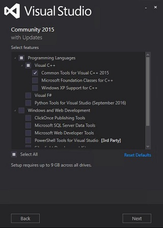

# Setup Migrate VS13 to VS15

We recently switched the default development environment on Windows from Visual Studio 2013 to Visual Studio 2015. If you did build CNTK from source code on Windows using Visual Studio 2013 in the past and want to move to a Visual Studio 2015 based development environment, this page is for you. 

If you are looking for any other kind of support in setting up a CNTK build environment or installing CNTK on your system, you should go [here](./Setup-CNTK-on-your-machine.md) instead. 

## Introduction
Next to the obvious switch to a new development environment, the new development environment comes with a different set of run-time libraries and dependencies. The following pages will guide you through the required changes and installation steps. 

The required changes performed here are additive, that means that we will install versions of libraries and tools specific to building CNTK with Visual Studio 2015. Next to installation of these tools, we need to adjust the system environment variables to refer to the new location.

Instead of doing all these steps manually as described on this page, you can also initiate the script driven process as described [here](./Setup-CNTK-with-script-on-Windows.md).

### Environment Variables 

For an overview of the environment variables used by the Windows build of CNTK please see this [page](./Windows-Environment-Variables.md).

## Visual Studio 2015 with Update 3

***Required***

Install Microsoft Visual Studio 2015.3 for Windows. A link to the download can be found [here](https://www.visualstudio.com/vs/). Please install Visual Studio 2015, not a previous version or the 2017-Preview! The Community Version of Visual Studio 2015 is sufficient to build CNTK.

During the installation process please select custom installation:


On the feature selection screen make sure you add 'Common Tools for Visual C++ 2015' to your installation:



### Pre-Existing Visual Studio 2015 installation
If you already have VS 2015 installed, make sure you are on **Update 3**. See the `Help->About` menu to display the version number like "Version 14.0.25431.01 Update 3". 

You are also required to have the 'Common Tools for Visual C++ 2015' installed on your system. To check open the Windows "Control Panel -> Programs -> Programs and Features' and select 'Microsoft Visual Studio Enterprise 2015 with Updates' from the list of installed programs. This will start the Visual Studio setup again and allows you to make sure the 'Common Tools for Visual C++ 2015' feature is installed on your system (see picture above).

## NVIDIA CUDA 8

***Required for GPU build***

***Important*** In case you have a first-time Visual Studio 2015 installation as described above, you will need to install NVIDIA CUDA 8 now, even if you have already an existing installation of CUDA 8! The NVIDIA CUDA 8 installation adds support to the NVIDIA development tools to the Visual Studio environment, which is required to build CNTK successfully.

CNTK is set to build with CUDA 8.0. Download and install the NVIDIA CUDA 8.0 Toolkit:
* Download the required package from [this download page](https://developer.NVIDIA.com/CUDA-downloads)
* Run the installation procedure

Make sure that the following CUDA environment variables are set to the correct path (the NVIDIA Cuda installer will create these for you). Default installation paths are assumed:
```
CUDA_PATH="C:\Program Files\NVIDIA GPU Computing Toolkit\CUDA\v8.0"
CUDA_PATH_V8_0="C:\Program Files\NVIDIA GPU Computing Toolkit\CUDA\v8.0"
```

### cuDNN

***Required for GPU build***

Install `NVIDIA CUDA Deep Neural Network library` also known as [cuDNN](https://developer.NVIDIA.com/cuDNN) in the version **NVIDIA: cuDNN v5.1 for CUDA 8.0** from this [link](http://developer.download.NVIDIA.com/compute/redist/cudnn/v5.1/cudnn-8.0-windows10-x64-v5.1.zip). This version is suitable for Windows 8.1, Windows 10, as well as Windows Server 2012 R2 and later.

* Extract the archive to a folder on your local disk, e.g. to `C:\local\cudnn-8.0-v5.1\` and set the environment variable `CUDNN_PATH` pointing to that location, e.g.: 
```
    setx CUDNN_PATH C:\local\cudnn-8.0-v5.1\cuda
```
* Quick installation check: If you followed the instruction above and used the same paths, the command `dir C:\local\cudnn-8.0-v5.1\cuda\include\cudnn.h` will succeed.

##  MKL

***Required***

The version of our custom MKL library for CNTK changed for Visual Studio 2015. We recommend you install the custom CNTK-MKL into `c:\local\CNTKCustomMKL`

Installing the CNTK custom MKL library: 

* Create a directory on your machine to hold CNTK custom MKL versions, e.g.: 
```
    mkdir c:\local\CNTKCustomMKL
```
* Set the environment variable `CNTK_MKL_PATH` to point to this directory: 
```
    setx CNTK_MKL_PATH c:\local\CNTKCustomMKL
```
* Download the file [CNTKCustomMKL-Windows-3.zip](https://www.cntk.ai/mkl/CNTKCustomMKL-Windows-3.zip). Unzip it into your CNTK MKL path, creating a numbered sub directory within. For example, if you are on latest master, download and extract its contents to `c:\local\CNTKCustomMKL\3` (the top-level folder inside the ZIP archive is called `3`). For more information, see the [CNTK web site](https://www.cntk.ai/mkl).

## Boost

***Required***

Boost is requirement to build CNTK. In addition, you will need to update to a Boost version supporting Visual Studio 2015. We recommend you install the new Boost version into `c:\local\boost_1_60_0-msvc-14.0`

* Download and install Boost version 1.60 (you need the `msvc-14.0` binaries) from this <a href="http://sourceforge.net/projects/boost/files/boost-binaries/1.60.0/boost_1_60_0-msvc-14.0-64.exe/download" target="_blank">download location</a> on Sourceforge.
* Set the environment variable `BOOST_INCLUDE PATH` to your Boost installation, e.g.: 
```
    setx BOOST_INCLUDE_PATH c:\local\boost_1_60_0-msvc-14.0
```
* Set the environment variable `BOOST_LIB_PATH` to the Boost libraries, e.g.: 
```
    setx BOOST_LIB_PATH c:\local\boost_1_60_0-msvc-14.0\lib64-msvc-14.0
```
* To integrate the Boost test framework into Visual Studio you can install a runner for Boost tests in Visual Studio from the <a href="https://visualstudiogallery.msdn.microsoft.com/5f4ae1bd-b769-410e-8238-fb30beda987f" target="_blank">Visual Studio Gallery</a>.

## Protobuf

***Required***

You need a version of Protobuf 3.1.0 compiled for CNTK. You can compile this version by yourself, or use an already (precompiled) prepared version of Protobuf 3.1.0 (described on this page). If you want to build the Protobuf library for CNTK on your system, you can find the details [here](./Setup-BuildProtobuf-VS15.md)

Download the ZIP file containing the precompiled version of Protobuf for CNTK from [this location](https://cntk.ai/binarydrop/prerequisites/protobuf/protobuf-3.1.0-vs15.zip)

Extract the archive to a folder on your local disk, e.g. to `C:\local\protobuf-3.1.0-vs15` and set the environment variable `PROTOBUF_PATH` pointing to that location, e.g.: 
```
    setx PROTOBUF_PATH c:\local\protobuf-3.1.0-vs15
```
Quick installation check: If you followed the instruction above and used the same paths, the command `dir C:\local\protobuf-3.1.0-vs15\bin` will succeed.

## zlib and libzip

***Required if you are building the CNTK Imagereader***

If you are building CNTK with ZLib and LibZip, you will need to recompile these packages. You can compile this version by yourself, or use an already (precompiled) prepared version (described on this page). If you want to build the  libzip/zlib compression library for CNTK on your system, you can find the details [here](./Setup-Buildzlib-VS15.md)

Download the ZIP file containing the precompiled version of libzip/zlib compression library for CNTK from [this location](https://cntk.ai/binarydrop/prerequisites/zip/zlib-vs15.zip)

* Extract the archive to a folder on your local disk, e.g. to `C:\local\zlib-vs15` and set the environment variable `ZLIB_PATH` pointing to that location, e.g.: 
```
    setx ZLIB_PATH c:\local\zlib-vs15
```
* Quick installation check: If you followed the instruction above and used the same paths, the command `dir C:\local\zlib-vs15\bin` will succeed and show a couple of DLLs.

## Building CNTK

At this point you have finished the conversion of the CNTK build system to Visual Studio 2015. Make sure you have all the environmnent variables changed to the correct location. Start Visual Studio 2015 and perform a rebuild of the CNTK solution.

