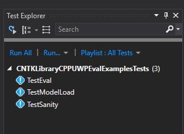

# CNTK Development Environment for Universal Windows Platform (UWP)

[!INCLUDE[versionadded-2.1-block](includes/versionadded-2.1-block.md)]

To build the CNTK configurations `Release_UWP` and `Debug_UWP` (for x64) in the CNTK Visual Studio solution file, you need to do the following:

## Install Workload: Universal Windows Platform development

Open the Control Panel, then navigate to Programs -> Programs and Features. Select Visual Studio 2017, and click 'Change', when the Visual Studio setup starts, select Workloads `Universal Windows Platform Development` option


This will take a few minutes to install.

## Install OpenBLAS

OpenBLAS is used as an alternative math library for CNTK UWP. The source code for OpenBlas can be found on [GitHub](https://github.com/xianyi/OpenBLAS). You can either use the pre-built version of OpenBLAS provided by the Microsoft Cognitive Toolkit team (the recommended installation path), or build it yourself.

### Using the pre-built OpenBLAS library

Create a directory on your machine, e.g.:

```
    mkdir c:\local\CNTKopenBLAS
```

Set the environment variable `CNTK_OPENBLAS_PATH` to point to this directory:

```
    setx CNTK_OPENBLAS_PATH c:\local\CNTKopenBLAS
```

Download the file [CNTKopenBLAS-Windows-2.zip](https://www.microsoft.com/en-us/cognitive-toolkit/download-openblas-uwp-library/). Unzip it into your CNTK openBLAS path, creating a numbered sub directory within. For example, if you are on latest master, download and extract its contents to `c:\local\CNTKopenBLAS\2` (the top-level folder inside the ZIP archive is called `2`).

To validate, the file `%CNTK_OPENBLAS_PATH%\2\cblas.h` must exist.

### Build OpenBLAS from source

This is an alternative to using the pre-built OpenBLAS library. Follow instructions from [here](https://github.com/xianyi/OpenBLAS/wiki/How-to-use-OpenBLAS-in-Microsoft-Visual-Studio#build-openblas-for-universal-windows-platform), then copy the resulting files into a local directory as described above, setting the `CNTK_OPENBLAS_PATH` environment variable.

# Build UWP configurations

Now restart Visual Studio and build `Release_UWP` or `Debug_UWP` configurations.

# Running tests

UWP-specific tests are located in the `Tests\EndToEndTests\EvalClientTests\CNTKLibraryCPPUWPEvalExamplesTests` directory.

Open Test Explorer window in Visual Studio. You should see a list of tests like this:


