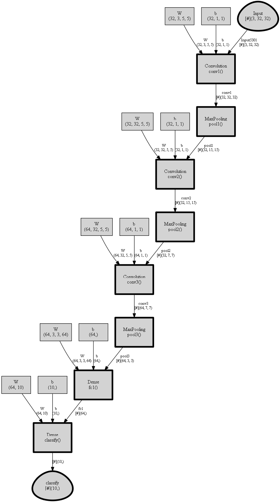

# Using Graphviz for Visualization

CNTK provides a simple way to visualize the underlying computational graph of a model using [Graphviz](https://graphviz.gitlab.io/), an open-source graph visualization software.

To illustrate a use case, let's first build a simple convolutional network using the [CNTK Layers library](https://cntk.ai/pythondocs/layerref.html).

```Python
import cntk as C

def create_model(x, num_classes):
  with C.layers.default_options(init=C.glorot_uniform(), activation=C.relu):
    model = C.layers.Sequential([
      C.layers.For(range(3), lambda i: [
        C.layers.Convolution((5,5), [32,32,64][i], pad=True, name=['conv1', 'conv2', 'conv3'][i]),
        C.layers.MaxPooling((3,3), strides=(2,2), name=['pool1', 'pool2', 'pool3'][i])
        ]),
      C.layers.Dense(64, name='fc1'),
      C.layers.Dense(num_classes, activation=None, name='classify')
    ])
  return model(x)
```

Now assuming we are training on the CIFAR-10 dataset, which consists of 32x32 images in 10 classes, we can assign the input shape correspondingly.
Refer to the [CNTK 201A](https://cntk.ai/pythondocs/CNTK_201A_CIFAR-10_DataLoader.html) tutorial for instructions on downloading and preparing the CIFAR-10 dataset for use in CNTK.

```Python
input_var = C.input_variable((3,32,32))
z = create_model(input_var)
```

To get the underlying description of the computational graph, CNTK provides a [`plot`](https://cntk.ai/pythondocs/cntk.logging.graph.html?#cntk.logging.graph.plot) function in the [`cntk.logging.graph`](https://cntk.ai/pythondocs/cntk.logging.graph.html?) module.
The `plot(root, filename=None)` function returns a network description of the graph starting at the `root` node provided. In addition, if `filename` is specified, the method outputs a DOT, PNG, PDF or SVG file (corresponding to the filename suffix).

In order to output the DOT output, you will need to install [`pydot-ng`](https://pypi.python.org/pypi/pydot-ng) (`pip install pydot_ng`). And if you would like PNG, PDF or SVG output, you will need [Graphviz](http://graphviz.org/download/) in addition to `pydot-ng`.
Once you've installed Graphviz, ensure that the Graphviz binaries are in your PATH environment variable.

```Python
import pydot_ng

graph_description = C.logging.graph.plot(z, "graph.png")
print(graph_description)
```

```
Convolution(Parameter5302, Parameter5303, Input5301) -> Block6011_Output_0;

MaxPooling(Block6011_Output_0) -> Block6023_Output_0;

Convolution(Parameter5332, Parameter5333, Block6023_Output_0) -> Block6039_Output_0;

MaxPooling(Block6039_Output_0) -> Block6051_Output_0;

Convolution(Parameter5362, Parameter5363, Block6051_Output_0) -> Block6067_Output_0;

MaxPooling(Block6067_Output_0) -> Block6079_Output_0;

Dense(Parameter5710, Parameter5711, Block6079_Output_0) -> Block6095_Output_0;

Dense(Parameter5730, Parameter5731, Block6095_Output_0) -> Block6110_Output_0;
```

If you are using a Jupyter Notebook, you can display the graph visualization output inline:

```Python
from IPython.display import Image

display(Image(filename="graph.png"))
```



For a more detailed example of visualization using `logging.graph.plot`, refer to the [How to debug](https://cntk.ai/pythondocs/Manual_How_to_debug.html) manual.
